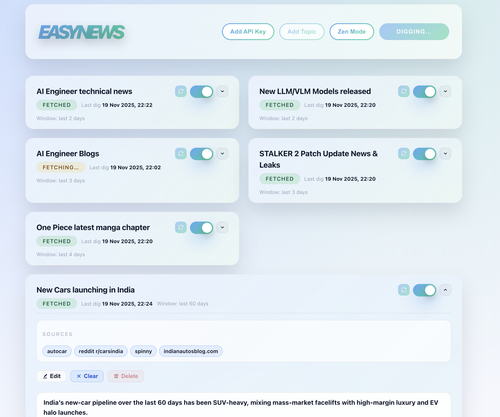
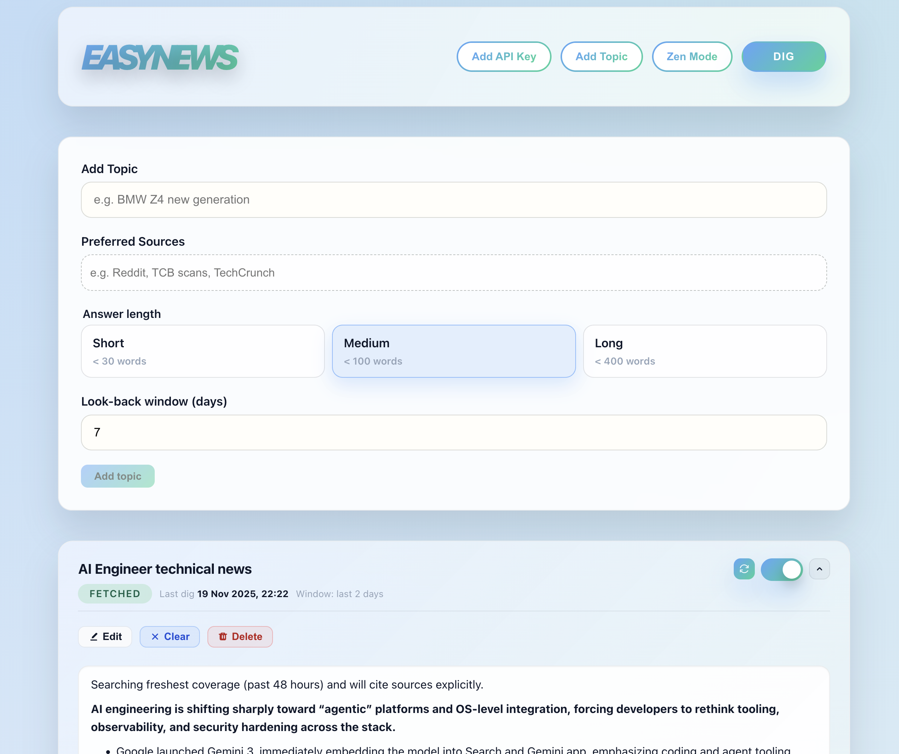

# EASYNEWS

Live preview (use your own OpenAI API key): https://strcoder4007.github.io/easynews/

- Deep research agent with web access that keeps every topic on a swappable deck, digs for breaking coverage, and lets you steer the prompt with explicit constraints.
- Works entirely in the browser—topics, prompts, and responses live in `localStorage`, so your desk opens instantly.



Keep all your news updated and in one place



## Core Capabilities

- **Topic deck:** create unlimited topics, toggle them on/off, and reorder the list by editing timeframe windows.
- **Guided digging:** the DIG action crafts an OpenAI prompt from your topic name + optional guardrails, then asks for recent web-sourced updates.
- **Web-aware output:** responses include links, timestamps, and markdown copied straight into Zen Mode for distraction-free reading.
- **Stateful cards:** each topic shows Idle/Fetching/Fetched/Error status, last run time, and quick actions for clearing, deleting, or editing.
- **Zen Mode:** opens a minimal modal that strings all fetched summaries together for fast scan reading.

## Requirements & Inputs

- Node.js 18+ and npm.
- An OpenAI API key with access to the Responses API (paste it via **Add API KEY** in the header).
- Environment variables for default models:

  ```bash
  VITE_OPENAI_MODEL=gpt-5.1-2025-11-13
  VITE_OPENAI_MODEL_SMALL=gpt-5-mini-2025-08-07
  ```

## Setup

- Install dependencies:

  ```bash
  npm install
  ```

- (Optional) seed a config file:

  ```bash
  cp .env.example .env
  ```

- Run the dev server:

  ```bash
  npm run dev
  ```

- Build the static site (outputs to `docs/` for GitHub Pages):

  ```bash
  npm run build
  ```

## Daily Flow

- Enter a topic title (e.g., “AI policy in EU”) and hit **Add Topic**; the label becomes the research prompt.
- Add per-topic sources or constraints, choose answer length + timeframe, and click **DIG** to fetch the latest summary.
- Re-run DIG anytime; cached responses persist until you clear them or delete the topic.
- Switch to **ZEN** to read every fetched summary without UI chrome.

## Tips

- You can maintain multiple topic decks; only enabled topics participate in DIG runs, so disable anything you want to pause.
- Clearing a topic wipes both the cached response and the stored prompt so nothing stale is left behind.
- Because everything is local storage, switching browsers or clearing site data requires re-entering the API key and topics.
